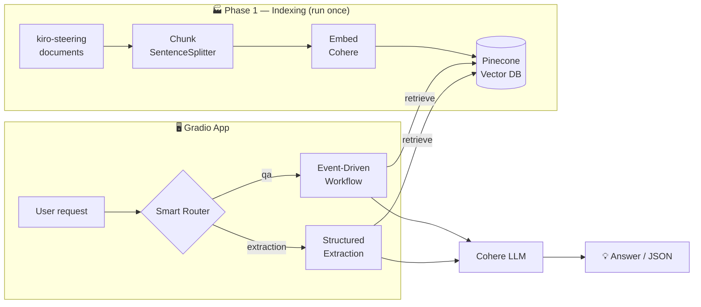
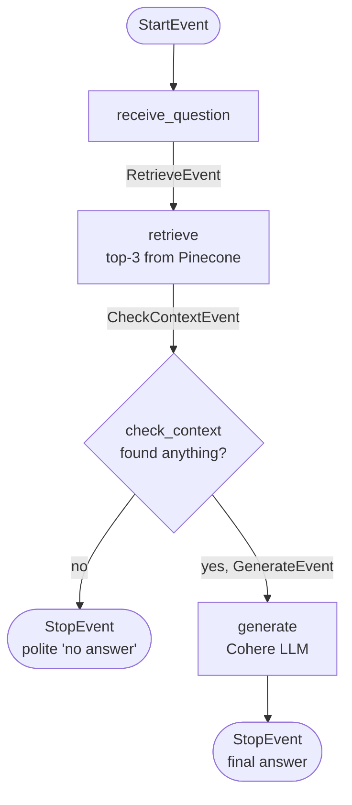
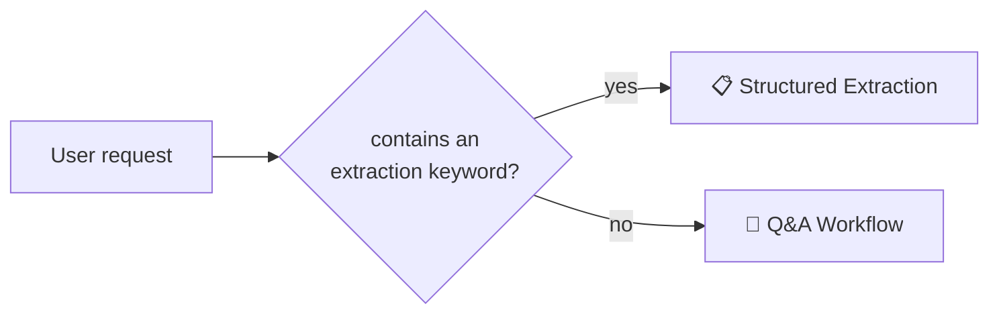

<div align="center">

# 🧠 RAG Assistant for *Spirit of Kiro*

### Ask questions, extract structured JSON, or let a smart router choose the right flow — all over your own documents.

A complete, beginner-friendly **Retrieval-Augmented Generation (RAG)** pipeline built step by step:
from raw documents ➜ vector index ➜ event-driven Q&A ➜ structured extraction ➜ smart routing ➜ a polished web app.

<br>

`🐍 Python 3.14+`  ·  `🦙 LlamaIndex`  ·  `🔮 Cohere`  ·  `🌲 Pinecone`  ·  `🎨 Gradio`  ·  `⚡ uv`

</div>

---

## 📖 Table of Contents

- [✨ What is this?](#-what-is-this)
- [🚀 Features](#-features)
- [🏗️ Architecture](#️-architecture)
- [🧩 Tech Stack](#-tech-stack)
- [🗂️ Project Structure](#️-project-structure)
- [📦 The 5 Phases](#-the-5-phases)
- [⚡ Quickstart](#-quickstart)
- [🎮 Usage & Examples](#-usage--examples)
- [🔑 Environment Variables](#-environment-variables)
- [🔬 How It Works (Deep Dive)](#-how-it-works-deep-dive)
- [👩‍💻 Author](#-author)

---

## ✨ What is this?

**RAG** lets a Large Language Model answer questions about *your* data instead of guessing from its training.
The documents are turned into numeric **embeddings**, stored in a **vector database**, and the most relevant
chunks are retrieved and handed to the LLM as context — so answers are **grounded in your documents**.

This project applies that idea to the **Spirit of Kiro** steering documents (an AI-powered infinite-crafting
workshop game) and grows it into a small but complete product across **five phases**.

```
Question ─▶ Embed ─▶ Search Pinecone ─▶ Relevant chunks ─▶ LLM ─▶ Grounded answer
```

---

## 🚀 Features

| | Feature | Description |
|---|---------|-------------|
| 💬 | **Document Q&A** | Ask natural-language questions and get answers grounded in your indexed docs. |
| ⚙️ | **Event-Driven Workflow** | The Q&A pipeline is split into clear, observable steps using LlamaIndex Workflows. |
| 📋 | **Structured Extraction** | Turn documents into clean, validated **JSON** (features, tech stack, AWS services…). |
| 🧭 | **Smart Router** | Automatically sends each request to Q&A *or* extraction — and tells you which it chose. |
| 🖥️ | **Polished Gradio UI** | A three-tab web app with a clean theme and a custom footer. |
| 🧪 | **CLI-Testable** | Every phase can be run and tested straight from the terminal. |
| 🔒 | **Safe Config** | API keys live in `.env` — never hardcoded — with clear errors if one is missing. |

---

## 🏗️ Architecture



---

## 🧩 Tech Stack

| Layer | Technology | Notes |
|-------|------------|-------|
| **Orchestration** | [LlamaIndex](https://docs.llamaindex.ai/) | RAG primitives + event-driven **Workflows** |
| **Embeddings** | Cohere `embed-english-v3.0` | `search_document` for indexing, `search_query` for questions |
| **LLM** | Cohere `command-a-03-2025` | Generates answers & structured JSON (Chat API) |
| **Vector DB** | [Pinecone](https://www.pinecone.io/) | Index `kiro`, namespace `kiro-steering` |
| **UI** | [Gradio](https://www.gradio.app/) | Three-tab web interface |
| **Tooling** | [uv](https://github.com/astral-sh/uv) | Fast dependency & environment management |

---

## 🗂️ Project Structure

```
RAG with LlamaIndex/
├── prepare.py        # Phase 1 — load, chunk, embed & index documents into Pinecone
├── workflow.py       # Phase 3 — event-driven RAG Q&A workflow (also builds shared retriever + LLM)
├── extraction.py     # Phase 4 — structured JSON extraction
├── router.py         # Phase 5 — rule-based router (qa vs extraction)
├── app.py            # Gradio UI — Q&A · Structured Extraction · Smart Router tabs
├── kiro-steering/    # Source documents to index
├── pyproject.toml    # Project metadata & dependencies
├── requirements.txt  # Plain-pip dependency list
├── .env              # Your API keys (not committed)
└── README.md         # You are here ✨
```

---

## 📦 The 5 Phases

This project was built incrementally — each phase adds one capability **without breaking the previous ones**.

| Phase | File | What it adds | Run it |
|:----:|------|--------------|--------|
| **1️⃣ Indexing** | `prepare.py` | Loads, chunks, embeds & stores documents in Pinecone | `uv run prepare.py` |
| **2️⃣ Q&A App** | `app.py` | A Gradio interface to ask questions | `uv run app.py` |
| **3️⃣ Workflow** | `workflow.py` | Splits Q&A into observable event-driven steps | `uv run workflow.py "..."` |
| **4️⃣ Extraction** | `extraction.py` | Returns a structured **JSON** summary | `uv run extraction.py` |
| **5️⃣ Routing** | `router.py` | Auto-picks Q&A or extraction per request | `uv run router.py "..."` |

✅ All five phases are implemented and working.

---

## ⚡ Quickstart

### 1. Install dependencies

```bash
# Recommended (uv)
uv sync

# …or with plain pip
pip install -r requirements.txt
```

### 2. Add your API keys

Create a `.env` file in the project root:

```env
COHERE_API_KEY=your_cohere_key
PINECONE_API_KEY=your_pinecone_key
PINECONE_INDEX_NAME=kiro
```

> 🔐 Keys are read from `.env` at runtime and are **never** hardcoded. A missing key produces a clear, friendly error.

### 3. Build the index (once)

```bash
uv run prepare.py
```

This reads everything in `kiro-steering/`, splits it into chunks, embeds them with Cohere, and uploads them to Pinecone.

### 4. Launch the app 🎉

```bash
uv run app.py
```

Open the printed URL (usually **http://127.0.0.1:7860**) and explore the three tabs.

---

## 🎮 Usage & Examples

### 💬 Q&A

> **Q:** *What is the Spirit of Kiro project and its main features?*
>
> **A:** Spirit of Kiro is an infinite crafting workshop game that showcases AI-powered game
> development — featuring infinite item generation, a dynamic crafting system, intelligent
> appraisal, and real-time multiplayer, powered by AWS Bedrock models.

Run it from the terminal:

```bash
uv run workflow.py "What is the Spirit of Kiro project and its main features?"
```

### 📋 Structured Extraction

```bash
uv run extraction.py
```

```json
{
  "project_name": "Spirit of Kiro",
  "project_type": "infinite crafting workshop game",
  "main_features": ["Infinite Item Generation", "Dynamic Crafting System", "Intelligent Appraisal", "Real-time Multiplayer"],
  "ai_integrations": ["Item generation", "Crafting logic", "Item appraisal", "Image generation via Nova Canvas"],
  "frontend_technologies": ["Vue.js 3", "Pinia", "Vite", "Vue Router", "Vitest"],
  "backend_technologies": ["Bun WebSocket Server", "AWS SDK", "Sharp", "Redis"],
  "aws_services": ["Amazon Bedrock", "DynamoDB", "Amazon Cognito", "S3 + CloudFront", "MemoryDB"],
  "development_commands": ["bun dev", "bun install", "..."]
}
```

### 🧭 Smart Router

```bash
uv run router.py "What is Spirit of Kiro?"             # -> Route selected: qa
uv run router.py "Extract the project summary as JSON"  # -> Route selected: extraction
```

The response always begins with the chosen route, e.g. `Route selected: qa`.

---

## 🔑 Environment Variables

| Variable | Required | Description |
|----------|:--------:|-------------|
| `COHERE_API_KEY` | ✅ | Cohere key — used for **both** embeddings and the LLM |
| `PINECONE_API_KEY` | ✅ | Pinecone key — access to your vector database |
| `PINECONE_INDEX_NAME` | ✅ | Name of the Pinecone index (e.g. `kiro`) |

---

## 🔬 How It Works (Deep Dive)

### ⚙️ Phase 3 — The Event-Driven Workflow

Instead of one big function, answering is broken into **steps** that pass **events** and share a small **state** object (`RAGState`).



- **State** — `RAGState` holds `question`, `chunks`, `context_found`, `answer`.
- **Events** — `RetrieveEvent`, `CheckContextEvent`, `GenerateEvent` + built-in `StartEvent` / `StopEvent`.
- **Steps** — methods of `RAGWorkflow`, each printing a `[workflow] …` trace so you can watch the flow live.

### 📋 Phase 4 — Structured Extraction

1. Runs several **targeted queries** and merges the unique chunks (broad coverage of every field).
2. Asks the LLM to return **only JSON**, using **only** the retrieved context — empty `""`/`[]` when unknown, **never invented**.
3. **Parses & normalizes** so every expected field always exists.

Extracted fields:

```
project_name · project_type · main_features · core_game_loop · ai_integrations
frontend_technologies · backend_technologies · aws_services · development_commands
```

It reuses the retriever + LLM from Phase 3 — **no second Pinecone connection, no re-indexing**.

### 🧭 Phase 5 — Smart Routing



`classify_request()` returns `"extraction"` when the text mentions keywords like
*json, structured, extract, fields, project summary, technologies list, aws services list, development commands* —
otherwise `"qa"`. It's lightweight, **rule-based** keyword matching (no extra LLM call, no new dependencies).

---

## 📄 License

Released under the [MIT License](LICENSE) — free to use, modify, and share.

---

## 👩‍💻 Author

<div align="center">

**Created by Yehudit Pollock**

📦 [GitHub Repository](https://github.com/yt314/rag-llamaindex-project) &nbsp;·&nbsp; 👤 [GitHub Profile](https://github.com/yt314)

<sub>Final project · AI Developer course · Built with LlamaIndex, Cohere, Pinecone & Gradio.</sub>

</div>
